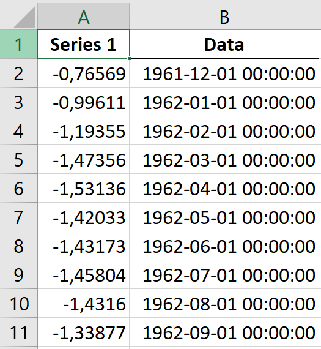

# Rede Neural Secas


## Configuração

### 1. Preparar os Dados

Insira os arquivos de dados das cidades no formato `.xlsx` na pasta `Data`. Cada arquivo deve estar no seguinte formato:



Onde a primeira coluna é o valor do SPEI e a segunda coluna é a data correspondente.

Os dados podem ser adquiridos através deste repositório: [GenerateCitiesSPEI](https://github.com/JVSREco19/GenerateCitiesSPEI).

2. **Executar os Scripts:**

Existem dois scripts principais que você pode usar para treinar e testar o modelo:

- **`runOneToMany.py`**: Este script usa uma cidade como modelo para prever o SPEI das demais cidades. Para usá-lo, defina o nome da cidade na variável `city` na linha 35 do script. O modelo será treinado usando essa cidade e fará previsões para todas as outras cidades na pasta `Data`.

  ```python
  # Defina o nome da cidade aqui
  city = "NomeDaCidade"
  ```

- **`runManyToMany.py`**: Este script compara todas as cidades da pasta `Data` entre si. Por exemplo, se houver 5 cidades, você obterá 25 resultados (cada cidade sendo usada como modelo para todas as outras).

